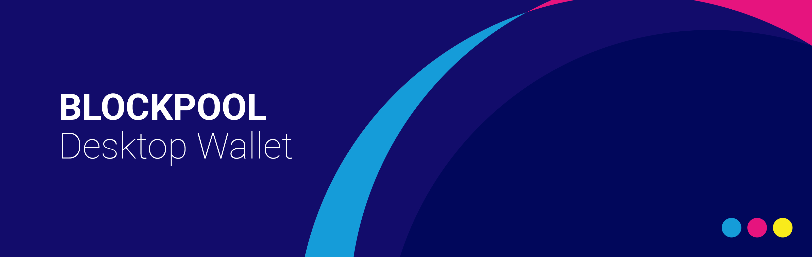

# BPL Desktop Wallet

<p align="center">
    
</p>

[](https://travis-ci.org/blockpool-io/BPL-desktop)
[](https://github.com/blockpool-io/bpl-desktop/releases/latest)
[](https://github.com/blockpool-io/bpl-desktop/releases/latest)
[](https://opensource.org/licenses/MIT)

## Features
* Available on ***Windows***, ***Linux*** (Ubuntu/Debian) and ***macOS*** (signed)
* No need to download BPL blockchain, just sync to the network: launch and use within seconds
* View any account from its address (transactions, delegate status and votes)
* Label any account and add your own contacts
* Hardware wallet support: Ledger Nano S
* Real-time currency value (updated every 5 min) in USD, EUR, BTC, HKD, JPY, CNY, AUD, GBP, RUB, ...
* Autoconnect to a healthy BPL network peer. If the peer is not good anymore, it will automatically find a new one
* Send BPL from / to any account
* Easily switch to a different network, or private chains
* Customized backgrounds and themes for better user experience
* Choose between dark or light mode
* Isolated processes on Windows and macOS to prevent from data sniffing or injection
* Translations (thanks to the BPL community)
* Organise your accounts with virtual folders (for instance savings, personnal etc...) so you don't pay any transfer fee (stored locally)
* Change your delegate vote
* When new version is available, the wallet will let you know
* Easy to update - download latest version, start installation program and it will automatically remove previous version and install new one
* Second signature supported
* **SAVE YOUR PASSPHRASE(S) - if you lose it, you lose access to that particular BPL address(es). There is no forgot my password option with blockchains and no one can help you retrieve it!**

## Installation

### Download
[Latest Release](../../releases/latest)

### From code

To clone and run this repository you'll need [Git](https://git-scm.com) and [Node.js](https://nodejs.org/en/download/) (which comes with [npm](http://npmjs.com)) installed on your computer. Optionally switch to node 8.11.2, because this is currently developped with this version:
```
sudo npm install -g n
sudo n 8.11.2
```

Install from source:
```bash
# Clone this repository
git clone https://github.com/blockpool-io/BPL-desktop

# Go into the repository
cd BPL-desktop

# Install dependencies 
npm install
```

* In some cases, [node-hid](https://github.com/node-hid/node-hid) doesn't provide pre-built binaries, so is necessary to install the [node-hid dependencies](https://github.com/node-hid/node-hid#compiling-from-source) to build them from source before running `npm install`.

Then start:
```bash
npm start
```

### Necessary to package from macOS

```
brew tap Homebrew/bundle
brew bundle
```

### Necessary to package from Linux

* Compilation Tools: ```apt-get install build-essential git```
* Gcc4.8: ```apt-get install gcc-4.8 g++-4.8 && export CXX=g++-4.8```
* libusb-1.0.0 headers: ```sudo apt-get install libusb-1.0.0 libusb-1.0.0-dev```


## Contributing
Read more about the [Developer Bounty Programme](https://www.blockpool.io/developer-bounty-programme) to learn about how to contribute to this project.

## Authors
- [Raj Singh](https://github.com/cyrus19901)
- [Brandon Cook](https://github.com/locohammerhead)
- [FX Thoorens](https://github.com/fix)
- [Guillaume Verbal](https://github.com/Doweig)
- [All Contributors](../../contributors)

## License
[MIT](LICENSE) © [Blockpool](https://blockpool.io)
